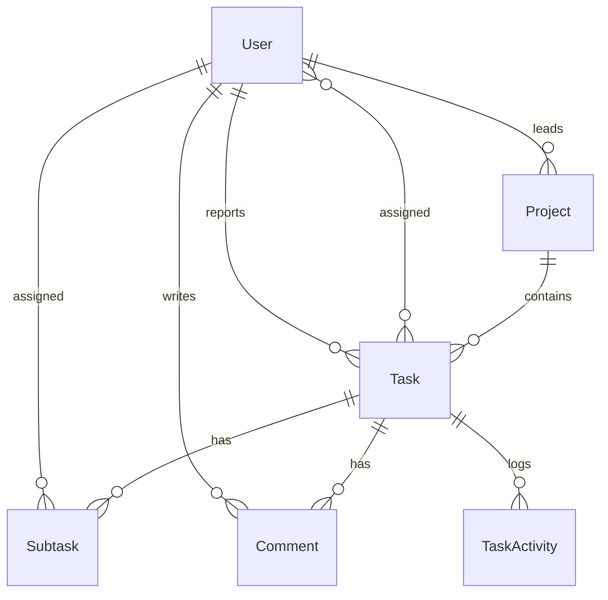

# Pyramid — Task Management

A task and project management workspace built for the AbleSpace Full Stack
Developer assessment. Monorepo with two apps:

```
pyramid/
├── backend/    NestJS + Prisma + PostgreSQL API
├── frontend/   Next.js 14 (App Router) + Tailwind CSS
└── docker-compose.yml   local Postgres for development
```

## Stack

| Layer      | Choice                                             |
| ---------- | --------------------------------------------------- |
| Frontend   | Next.js 14 (App Router), TypeScript, Tailwind CSS   |
| Backend    | NestJS 10, TypeScript                                |
| Database   | PostgreSQL via Prisma ORM                            |
| Auth       | JWT (guest sessions) + Google OAuth (Passport)       |
| Data layer | @tanstack/react-query                                |
| Drag & drop| @hello-pangea/dnd                                    |

PostgreSQL + Prisma was chosen over the other allowed options because the
domain (users → projects → tasks → subtasks/comments) is inherently
relational, and Prisma's generated types keep the frontend and backend in
sync with minimal boilerplate.

## Data model



Full schema: [`backend/prisma/schema.prisma`](backend/prisma/schema.prisma) — it has
inline comments explaining each modeling decision.

## Running locally

**1. Database**

```bash
docker compose up -d          # starts Postgres on localhost:5432
```

**2. Backend**

```bash
cd backend
cp .env.example .env          # defaults already match docker-compose
npm install
npm run prisma:migrate        # creates tables
npm run seed                  # optional demo data
npm run start:dev             # http://localhost:4000/api
```

**3. Frontend**

```bash
cd frontend
cp .env.local.example .env.local
npm install
npm run dev                   # http://localhost:3000
```

Open `http://localhost:3000` and click **Continue as Guest** — no setup
required. **Login with Google** needs your own OAuth credentials (see
`backend/.env.example` for where they go); it's fully wired up, it just
can't run with placeholder credentials.

## Deploying

- **Database**: [Neon](https://neon.tech) or [Supabase](https://supabase.com) free tier — copy the connection string into `DATABASE_URL`.
- **Backend**: [Render](https://render.com) or [Railway](https://railway.app) (Node web service). Set `DATABASE_URL`, `JWT_SECRET`, `FRONTEND_URL`, and run `npm run prisma:deploy` as a release step.
- **Frontend**: [Vercel](https://vercel.com) — set `NEXT_PUBLIC_API_URL` to the deployed backend's `/api` URL.

## Notable decisions / deviations from the Figma file

The Figma file wasn't directly accessible during this build (no Figma
integration available), so the implementation is based closely on the
provided screenshots rather than the source file itself. Specifics worth
knowing before the interview:

- **Board column order isn't persisted.** Dropping a card moves it between
  statuses immediately (optimistic UI + a real API call), but its exact
  vertical position within a column isn't stored — cards are ordered by
  creation date. A production version would add a fractional-index `order`
  column so drag position survives a refresh.
- **Labels and Team are plain strings**, not their own database tables. The
  reference design only shows a fixed, unmanaged label set and no
  team-management screen, so a full `Label`/`Team` entity with CRUD would be
  over-engineering for what's actually specified.
- **The second "Subtasks" heading** that appears below the subtasks table in
  the task-detail screenshot (right above the comment thread) reads like a
  copy-paste label left over in the source file — a comment thread follows
  it, not more subtasks — so it's implemented here as "Comments."
- **"Leave Workspace"** signs a real (Google) user out and deletes a guest
  account outright, since this starter models a single shared workspace
  rather than multi-tenant workspaces. A multi-workspace version would
  delete a membership row instead.
- **Auth storage**: the JWT is kept in `localStorage` rather than an
  httpOnly cookie, for simplicity in a project this size. A production
  version should move to httpOnly cookies to reduce XSS exposure.
- Color values (the six accent modes, priority colors, etc.) were sampled
  directly from the provided screenshots rather than guessed — notably,
  the "Blue" accent renders as a violet (`#9333ea`) in the source design,
  not literal blue, and that's preserved here for fidelity.

## Project structure

```
backend/src/
├── auth/          guest + Google OAuth, JWT strategy/guard
├── users/         profile, theme/accent preferences, leave workspace
├── projects/      project CRUD
├── tasks/         task CRUD, nested subtasks + comments, activity log
└── prisma/        PrismaService (global module)

frontend/
├── app/                    routes (App Router)
│   ├── login/
│   └── (dashboard)/        tasks, projects, settings — behind auth
├── components/
│   ├── sidebar/             the hover profile card + theme/color submenus
│   ├── tasks/                board, list view, detail page, toolbar
│   └── projects/
└── lib/                     api client, shared types, utils
```

## Known gaps / next steps

- `prisma generate` couldn't be run to completion in the sandbox this was
  built in (its query-engine download is blocked by that sandbox's network
  allowlist) — it will generate normally in any environment with regular
  internet access; this is a sandbox limitation, not a schema issue.
- No automated tests yet.
- Google OAuth needs real credentials to actually authenticate (see above).
