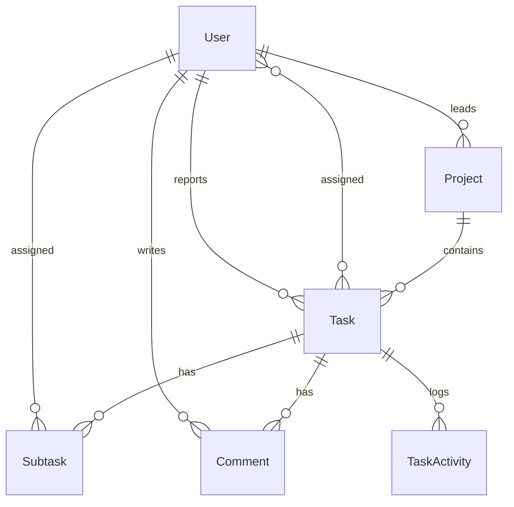

# Pyramid — Task Management

A task and project management workspace built for the AbleSpace Full Stack
Developer assessment. Monorepo with two apps:

```
pyramid/
├── backend/    NestJS + Prisma + MongoDB Atlas API
└── frontend/   Next.js 14 (App Router) + Tailwind CSS
```

## Stack

| Layer      | Choice                                             |
| ---------- | --------------------------------------------------- |
| Frontend   | Next.js 14 (App Router), TypeScript, Tailwind CSS   |
| Backend    | NestJS 10, TypeScript                                |
| Database   | MongoDB Atlas via Prisma ORM                         |
| Auth       | JWT (guest sessions) + Google OAuth (Passport)       |
| Data layer | @tanstack/react-query                                |
| Drag & drop| @hello-pangea/dnd                                    |

MongoDB Atlas was chosen for its free, fully-managed hosted tier — no local
database to install or separately deploy. Prisma still sits in front of it
as the ORM, which is what makes this swap cheap: the generated **Client
API** (`findMany`, `include`, nested `connect`/`set`, etc.) is identical
regardless of provider, so `TasksService`, `ProjectsService`, `UsersService`,
and `AuthService` didn't need a single line changed — only `schema.prisma`
and the connection config did. See the comments at the top of
`backend/prisma/schema.prisma` for exactly what's different about modeling
this in MongoDB (mainly: no native join tables, so the one many-to-many
relation — task assignees — uses Prisma's explicit array-of-ObjectId
pattern instead of an implicit join table).

## Data model



Full schema: [`backend/prisma/schema.prisma`](backend/prisma/schema.prisma) — it has
inline comments explaining each modeling decision.

## Running locally

**1. Database** — create a free MongoDB Atlas cluster and grab its
connection string. No local install needed. Full walkthrough below.

**2. Backend**

```bash
cd backend
cp .env.example .env          # paste your Atlas connection string into DATABASE_URL
npm install
npm run prisma:push           # syncs indexes/validation to your Atlas cluster
npm run seed                  # optional demo data
npm run start:dev             # http://localhost:4000/api
```

`prisma db push` is the MongoDB equivalent of `prisma migrate` — Mongo is
schemaless, so there's nothing to "migrate," but `db push` still needs to
run once to create the unique indexes on `email`/`username`/`googleId`.

**3. Frontend**

```bash
cd frontend
cp .env.local.example .env.local
npm install
npm run dev                   # http://localhost:3000
```

Open `http://localhost:3000` and click **Continue as Guest** — no setup
required. **Login with Google** needs your own OAuth credentials (see
`backend/.env.example` for where they go); it's fully wired up, it just
can't run with placeholder credentials.

## Deploying

- **Database**: nothing extra to do — Atlas is already hosted. Just make sure Network Access allows connections from your backend host (see the setup walkthrough below).
- **Backend**: [Render](https://render.com) or [Railway](https://railway.app) (Node web service). Set `DATABASE_URL`, `JWT_SECRET`, `FRONTEND_URL`, and run `npm run prisma:push` as a release step.
- **Frontend**: [Vercel](https://vercel.com) — set `NEXT_PUBLIC_API_URL` to the deployed backend's `/api` URL.

## Notable decisions / deviations from the Figma file

The Figma file wasn't directly accessible during this build (no Figma
integration available), so the implementation is based closely on the
provided screenshots rather than the source file itself. Specifics worth
knowing before the interview:

- **Board column order isn't persisted.** Dropping a card moves it between
  statuses immediately (optimistic UI + a real API call), but its exact
  vertical position within a column isn't stored — cards are ordered by
  creation date. A production version would add a fractional-index `order`
  column so drag position survives a refresh.
- **Labels and Team are plain strings**, not their own database tables. The
  reference design only shows a fixed, unmanaged label set and no
  team-management screen, so a full `Label`/`Team` entity with CRUD would be
  over-engineering for what's actually specified.
- **The second "Subtasks" heading** that appears below the subtasks table in
  the task-detail screenshot (right above the comment thread) reads like a
  copy-paste label left over in the source file — a comment thread follows
  it, not more subtasks — so it's implemented here as "Comments."
- **"Leave Workspace"** signs a real (Google) user out and deletes a guest
  account outright, since this starter models a single shared workspace
  rather than multi-tenant workspaces. A multi-workspace version would
  delete a membership row instead.
- **Auth storage**: the JWT is kept in `localStorage` rather than an
  httpOnly cookie, for simplicity in a project this size. A production
  version should move to httpOnly cookies to reduce XSS exposure.
- Color values (the six accent modes, priority colors, etc.) were sampled
  directly from the provided screenshots rather than guessed — notably,
  the "Blue" accent renders as a violet (`#9333ea`) in the source design,
  not literal blue, and that's preserved here for fidelity.
- **Task assignees (many-to-many) use Prisma's explicit array-of-ObjectId
  pattern** (`Task.assigneeIds` / `User.assignedTaskIds`) rather than an
  implicit join table, since MongoDB has no native join tables — see the
  note at the top of `schema.prisma`. The Prisma Client calls in
  `tasks.service.ts` (`connect`/`set` on `assignees`) are unchanged from
  the relational version; Prisma keeps both arrays in sync underneath.
- **`User.email` and `User.googleId` are not `@unique`.** MongoDB can't
  sparse-index an optional `@unique` field through Prisma (a real,
  still-open Prisma limitation — see the note in `schema.prisma`), so the
  first guest user created would permanently claim the "null" slot and
  every guest after it would fail to sign up. PostgreSQL doesn't have this
  problem since it treats every `NULL` as distinct, which is why this
  didn't surface until after the MongoDB migration. `AuthService` enforces
  unique linking by looking up existing users before creating instead.

## Project structure

```
backend/src/
├── auth/          guest + Google OAuth, JWT strategy/guard
├── users/         profile, theme/accent preferences, leave workspace
├── projects/      project CRUD
├── tasks/         task CRUD, nested subtasks + comments, activity log
└── prisma/        PrismaService (global module)

frontend/
├── app/                    routes (App Router)
│   ├── login/
│   └── (dashboard)/        tasks, projects, settings — behind auth
├── components/
│   ├── sidebar/             the hover profile card + theme/color submenus
│   ├── tasks/                board, list view, detail page, toolbar
│   └── projects/
└── lib/                     api client, shared types, utils
```

## Known gaps / next steps

- `prisma generate` / `prisma db push` couldn't be run to completion in the
  sandbox this was built in (Prisma's engine binaries are fetched from a
  domain that sandbox's network allowlist blocks) — both will run normally
  in any environment with regular internet access; this is a sandbox
  limitation, not a schema issue. The schema syntax was reviewed by hand
  against Prisma's documented MongoDB patterns instead.
- No automated tests yet.
- Google OAuth needs real credentials to actually authenticate (see above).